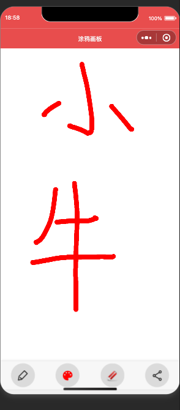

# 画板小程序

一个简单易用的微信小程序画板，支持自由绘画、调色和分享功能。

## 功能特点

- 画笔工具
  - 支持调节画笔粗细（1-50像素）
  - 支持RGB颜色自由调节
  - 预设多种常用颜色（黑、红、绿、蓝、黄、粉）
  
- 橡皮擦工具
  - 快速切换画笔/橡皮擦模式
  - 操作时会有模式提示

- 绘画设置
  - 显示/隐藏设置面板
  - 实时颜色预览
  - 画笔粗细滑动调节

- 分享功能
  - 支持保存到相册
  - 支持分享给好友