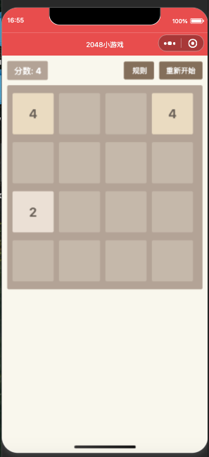

# 2048小游戏
一个经典的2048数字方块游戏微信小程序，支持触摸滑动操作，界面简洁，玩法有趣。

## 功能特点

游戏玩法

4x4经典布局
支持上下左右四个方向滑动
相同数字方块合并
自动生成新的数字方块
实时判定胜利与失败

游戏状态

实时记录分数统计
游戏结束自动提示
支持一键重新开始
达到2048自动判定胜利

操作设计

支持触摸滑动控制
设置最小滑动距离防误触
流畅的合并动画效果
支持游戏规则说明

界面交互

简洁明了的数字方块
不同数字对应不同颜色
清晰的分数显示
游戏状态实时反馈

快来挑战2048,体验数字合并的快感,享受益智游戏的乐趣吧! 