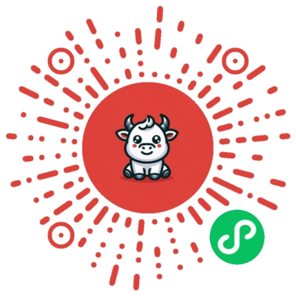

# nn-miniprogram

微信小程序项目集合 - 包含多个独立的小程序项目，均可在"小牛的学习助手"小程序中预览体验。

## 项目简介

本仓库收录了一系列独立开发的微信小程序项目。每个文件夹都是一个完整的小程序项目源码，可以独立运行和部署。所有项目均已整合到"小牛的学习助手"小程序中，方便用户一站式体验。

## 项目目录
- 001-画图小程序
- 002-拼图小程序
- 003-丑丑头像小程序
- 004-2048游戏小程序

持续更新中...

## 如何体验

方法一：手动搜索

打开微信
搜索小程序："小牛的学习助手"
进入小程序后可以选择体验不同的功能模块

方法二：扫码体验

## 开源协议

本项目采用 MIT 协议开源，详见 [LICENSE](./LICENSE) 文件。

---
